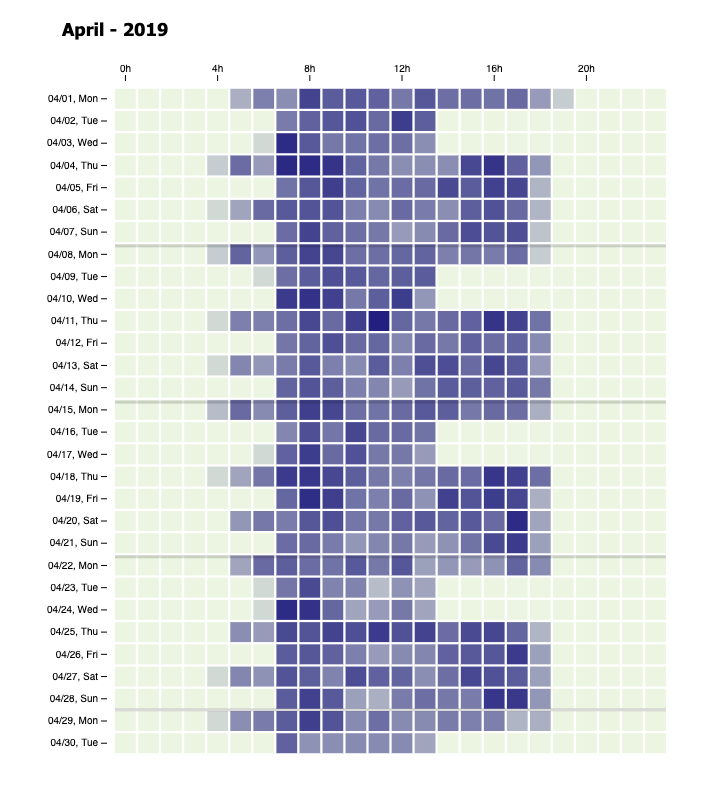
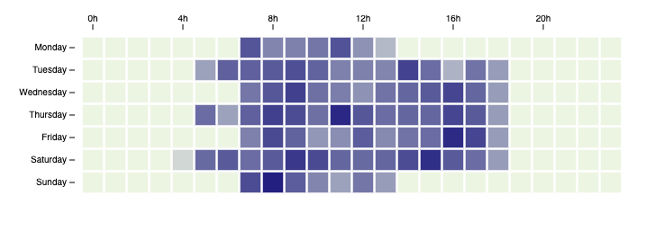

README
======

Description
-----------------

This Module allows you to create nicely looking heatmap calendars with ease. You can choose between the yearly, monthly and weekly format.

Preview
-----------------

#### Yearly:

<hr>

#### Monthly:

<hr>

#### Weekly:


Getting Started
-----------------

#### Installation

Embed the `d3-heatmap.js` aswell as [d3.js](https://d3js.org/) in your HTML

```html
<script src="d3.js"></script>
<script src="d3-heatmap.js"></script>
```

#### Basic Usage

```html
<div id="calendarContainer"></div>
<script>
	const data = {
		1553986800000: 0,
		1554069600000: 3,
		1554156000000: 5,
		1554242400000: 19,
		...
	};

	const heatmap = new HeatmapGenerator();
	heatmap.weekly("calendarContainer", data);
</script>
```

Documentation
-----------------

#### new HeatmapGenerator([settings]) 

Creates an instance of HeatmapGenerator.

##### Parameters

| Name | Type | Description | default | |
| ---- | ---- | ----------- | ------- | -------- |
| settings | `Object` | Object which holds all settings for the HeatmapGenerator | `{}` | *Optional* |
| settings.minColor | `color` | Color of the lowest datapoint in the heatmap - as HEX, RGB or CSS color code | `"#ECF5E2"` | *Optional* |
| settings.maxColor | `color` | Color of the highest datapoint in the heatmap - as HEX, RGB or CSS color code | `"#222081"` | *Optional* |
| settings.colorMode | `int` | Selects the way the colors are generated (1 => linear, 2 => sqrt or 3 => cubehelix) | `2` | *Optional* |
| settings.gutterSize | `float` | Defines the space inbetween the square (0 - 1) (not for yearly) | `0.1` | *Optional* |
| settings.outerSize | `float` | Defines the space inbetween the axis and the square (0 - 1) (not for yearly) | `0.35` | *Optional* |
| settings.scale | `float` | Defines the size of the heatmap | `1` | *Optional* |
| settings.showLines | `boolean` | Show axis lines? (not for yearly) | `false` | *Optional* |
| settings.showTicks | `boolean` | Show axis ticks? (not for yearly) | `true` | *Optional* |
| settings.locale | `String` | Locale - language used for months, weekdays and date formats | `"en-US"` | *Optional* |
| settings.dayNameLength | `String` | Defines the weekday format (long => "Friday", short => "Fri" or narrow => "F") | `"long"` | *Optional* |
| settings.showMonth | `boolean` | Show the months? | `true` | *Optional* |

##### Example

```javascript
const heatmap = new HeatmapGenerator({
	minColor: "#ECF5E2", // lowest datapoint's color in the heatmap - e.g. rgb(0, 255, 0) or #00ff00
	maxColor: "#222081", // highest datapoint's color in the heatmap - e.g. rgb(255, 255, 0) or #ffff00
	colorMode: 2, // switches between color scales (1: linear, 2: sqrt and 3: cubehelix)
	
	gutterSize: 0.1, // distance inbetween the squares (range: 0-1)
	outerSize: 0.35, // distance inbetween axis x, y and the squares
	scale: 0.8, // scale of the heatmap
	
	showLines: false, // show the axis line
	showTicks: true, // show the axis ticks
	locale: "de-DE", // defines the format of the date in the axis
	dayNameLength: "short", // style of the displayed weekday, options => long: "Friday", short: "Fri", narrow: "F" (uses locale)
	showMonth: true, // displays the months (uses locale)
})
```

##### Returns
- `Void`


#### HeatmapGenerator.weekly(container_id, data) 

Creates a heatmap calendar of one week

##### Parameters

| Name | Type | Description | |
| ---- | ---- | ----------- | -------- |
| container_id | `String` | ID of the container where the heatmap should be appended to | &nbsp; |
| data | `heatmapData` | Data for the heatmap | &nbsp; |

##### Returns
- `Void`


#### HeatmapGenerator.monthly(container_id, data) 

Creates a heatmap calendar of one month

##### Parameters

| Name | Type | Description | |
| ---- | ---- | ----------- | -------- |
| container_id | `String` | ID of the container where the heatmap should be appended to | &nbsp; |
| data | `heatmapData` | Data for the heatmap | &nbsp; |

##### Returns
- `Void`


#### HeatmapGenerator.yearly(container_id, data) 

Creates a heatmap calendar of one year

##### Parameters

| Name | Type | Description | |
| ---- | ---- | ----------- | -------- |
| container_id | `String` | ID of the container where the heatmap should be appended to | &nbsp; |
| data | `heatmapData` | Data for the heatmap | &nbsp; |

##### Returns
- `Void`


#### Data Format: heatmapData

```js
{
	timestamp: value,
	...
}
```